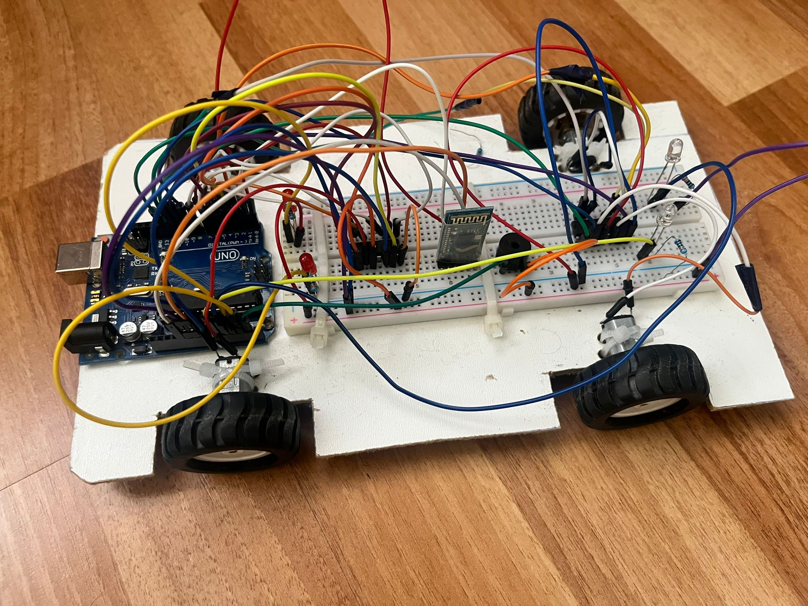

# Project Overview: Simulation of a Car's Functionality Using the Arduino Platform

## 1. What does the project do?  
My project consists of creating an interactive system that simulates the basic components and functionality of a car using an Arduino platform.
---

## 2. Project Purpose  
The main purpose of this project is to develop an educational platform that facilitates the understanding of the basic principles behind the functionality of a modern vehicle. It provides the opportunity to explore concepts in electronics, programming, and automation in a practical and hands-on way.  

The project aims to:  
- Help users understand the interaction between hardware and software components.  
- Develop practical skills in designing and implementing integrated systems.  
- Demonstrate how sensors and electronic components can be used to simulate a complex system like a car.  

---

## 3. Inspiration for the Project  
I started with the idea of combining learning with practical applicability, drawing inspiration from the complexity of modern automotive systems. I wanted to create an accessible and educational model that reflects, on a smaller scale, the basic functionality of a car.  

The main goal was to put into practice the knowledge I gained in microcontrollers and offer an interactive experience to users.  

---

## 4. Why do I believe it is useful?  

### For the community and peers:  
- This project provides an innovative and educational approach to electronic and mechanical systems, useful for both students and technology enthusiasts.  
- It serves as an example of how theoretical concepts can be integrated into a functional project.  
- It can be used as educational material or as inspiration for similar projects.  

### For me:  
- It allows me to deepen my knowledge of Arduino, sensors, and electronic displays.  
- It helps me develop problem-solving, programming, and hardware design skills.  
- It represents an opportunity to learn how to plan and implement a complex project.  

---

## **Project Features**

- **Gears and Engine Simulation**:
  - The car starts in **gear 0** (neutral) and cannot move until shifted into **gear 1**.
  - Gear progression:  
    - From gear 1 → 2 → 3.  
    - From gear 3 → 1 results in an engine stall.
  - Stalling:  
    - Engine stalls if an invalid gear shift is attempted.  
    - LEDs perform an animation, and a buzzer sound is triggered.  
    - The car must be reset to gear 1 to restart.  

- **Joystick-Controlled Movement**:
  - Forward, backward, left, and right movement via joystick.  
  - LEDs light up based on direction:  
    - **Forward**: Front LEDs turn on.  
    - **Backward**: Rear LEDs blink.  
    - **Left/Right**: Corresponding side LED turns on.  

- **Braking and Horn**:
  - Pressing the brake button activates rear LEDs.  
  - Pressing the joystick triggers the horn.  

- **Dashboard Display**:
  - Displays real-time information, including:  
    - Speed  
    - Current gear  
    - Direction of movement  
    - Engine status (e.g., stalling).  

---

## **System Overview**

The project consists of a car and a Bluetooth-connected remote control.

### **Hardware Components**
- Arduino Uno
- Bluetooth Module (HC-05)
- 4 DC Motors with L293D Drivers
- 16x2 LCD Display
- Joystick Module
- LEDs (Front and Rear)
- Buttons (Brake, Clutch, Horn)
- Buzzer
- Potentiometer (for LCD contrast)

---

### **How It Works**
1. **Starting the Car**:
   - The car starts in **gear 0** (neutral).
   - To move, press the clutch button and shift to **gear 1** using the joystick.

2. **Movement**:
   - Use the joystick to move the car in different directions:  
     - **Forward**: Front LEDs light up.  
     - **Backward**: Rear LEDs blink.  
     - **Left/Right**: Side LEDs turn on.  

3. **Gear Shifting**:
   - Gear shifting is sequential (1 → 2 → 3 or 3 → 2 → 1).  
   - Invalid shifts (e.g., 3 → 1) cause the engine to stall.  

4. **Indicators and Feedback**:
   - Brake button: Rear LEDs light up.  
   - Joystick press: Activates the horn (buzzer).  
   - Stalling:  
     - LEDs animate, and the buzzer sounds.  
     - Restart the car by shifting to **gear 1**.  

5. **LCD Dashboard**:
   - Displays:  
     - Speed  
     - Current gear  
     - Direction  
     - Engine status (e.g., "Stalled").  

---

## **Bill of Materials (BOM)**

| **Component**         | **Quantity** | **Description**                     | **Source/Link**                                                                                 | **Datasheet**                                                                 |
|------------------------|--------------|-------------------------------------|------------------------------------------------------------------------------------------------|-------------------------------------------------------------------------------|
| Arduino Uno            | 1            | Microcontroller for control         | University Of Bucharest                              | [Datasheet](https://store.arduino.cc/uno-rev3)                               |
| L293D Motor Driver     | 2            | Controls the DC motors              | University Of Bucharest                      | [L293D Datasheet](https://www.ti.com/lit/ds/symlink/l293d.pdf)               |
| DC Motors              | 4            | Provides car movement               | University Of Bucharest                                  | [DC Motor Datasheet](https://components101.com/motors/dc-motor)             |
| HC-05 Bluetooth Module | 2            | Enables Bluetooth communication     | [HC-05 Module](https://www.optimusdigital.ro/en/wireless-bluetooth/153-hc-05-master-slave-bluetooth-module-with-adapter-33v-and-5v-compatible.html)                                       | [HC-05 Datasheet](https://components101.com/wireless/hc-05-bluetooth-module)|
| 16x2 LCD Display       | 1            | Displays speed and status           | University Of Bucharest                                              | [LCD Datasheet](https://components101.com/displays/16x2-lcd-display-module) |
| Potentiometer          | 1            | Adjusts LCD contrast                | University Of Bucharest                                | N/A                                                                           |
| LEDs                   | 4            | Represents taillights               | University Of Bucharest                                       | [LED Datasheet](https://components101.com/leds/5mm-led-datasheet)           |
| Joystick Module        | 1            | For directions              | University Of Bucharest                                       | [Joystick Datasheet](https://components101.com/switches/joystick-module)    |
| Buttons                | 5            | Braking, clutch   | University Of Bucharest                                     | N/A                                                                           |
| Breadboard             | 1            | Simplifies connections              | University Of Bucharest                                           | N/A                                                                           |
| Resistors (330Ω)       | 4            | For LED protection                  | University Of Bucharest                                  | N/A                                                                           |
| Buzzer       | 1            | Acts as horn, stalling sound                  | University Of Bucharest                                  | [Buzzer Datasheet](https://www.mouser.com/datasheet/2/400/ef532_ps-13444.pdf)                                                                           |

---

## **Pin Configuration**

| **Component**        | **Pins Used**              | **Description**                                     |
|-----------------------|----------------------------|---------------------------------------------------|
| Motor 1              | 3, 4, 5                    | Direction and speed control (via PWM).            |
| Motor 2              | 6, 7, 8                    | Direction and speed control (via PWM).            |
| Motor 3              | 9, 10, 11                  | Direction and speed control (via PWM).            |
| Motor 4              | 12, 13, 2                  | Direction and speed control (via PWM).            |
| HC-05 Bluetooth      | 0 (RX), 1 (TX)             | Serial communication for wireless control.        |
| LCD                  | 8,9,10,11,12,13            | Display speed and status.                         |
| LEDs (Taillights)    | A0, A1, A2, A4             | Visual indicators controlled by a button.         |
| Buttons              | 2,3,4,7,11                 | Used for manual controls (e.g., brake, clutch).   |
| Joystick             | Analog Pins (A0, A1)       | Gear shifting input.                              |
| Buzzer               | A1       | Sound(e.g. horn)                             |

---

## **Functional Description**
- **Motors**: Four DC motors controlled using two L293D motor drivers.
  - Motor 1: Pins 3, 4, 5
  - Motor 2: Pins 6, 7, 8
  - Motor 3: Pins 9, 10, 11
  - Motor 4: Pins 12, 13, 2
  
- **Bluetooth Module (HC-05)**: Enables wireless control of the car through a Bluetooth controller.

- **LCD Display**: Displays the current status of the car, such as speed, direction, and gear.

- **Buttons**:
  - **Brake**: Stops the car by setting all motor pins to LOW.
  - **Clutch**: Allows gear shift using the joystick.
  - **Taillight Button**: Toggles LED taillights on or off.
  
- **Joystick**:
  - **Directional Control**: Used to control the direction of the car (forward, backward, left, right).
  - **Joystick Press**: Pressing the joystick triggers a buzzer sound.
  
- **Speed Control (Gear Shift)**:
  - **Gear Shift Buttons**: Three buttons representing the gears. These buttons control the car’s speed, increasing or decreasing it based on the gear selected.
  
## Functionality:
- **Joystick Directional Control**: 
  - Moving the joystick forward, backward, left, or right controls the movement of the car by adjusting motor directions.
  
- **Pressing the Joystick**:
  - Pressing the joystick produces a sound from the buzzer, indicating that the gear has been shifted or a special action has been triggered.

- **Gear Shifting**:
  - The three speed control buttons represent the car's gears:
    - **Low Gear**: Slow speed
    - **Medium Gear**: Moderate speed
    - **High Gear**: Fast speed
  - The speed of the motors increases or decreases based on the selected gear.
  
- **Brake**:
  - The **Brake Button** immediately stops the car by setting motor pins LOW, cutting off power to the motors.
  
- **Clutch**:
  - The **Clutch Button** enables or disengages the gear by using the joystick, allowing smooth shifting between gears.

- **Taillights**:
  - The **Taillight Button** controls the LED taillights of the car, toggling them on and off for visibility and signaling.

- **Bluetooth Control**:
  - The **HC-05 Bluetooth module** allows the car to be controlled remotely via a smartphone or Bluetooth device.

- **LCD Display**:
  - The **LCD** shows the current speed, gear, and car status (direction, brake, taillights, etc.).
 
  

---
